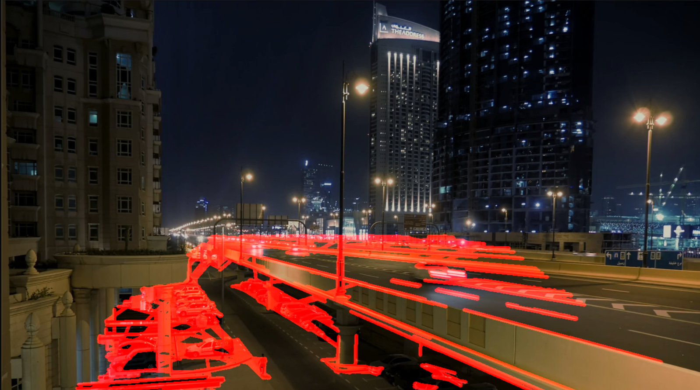

# Autonomous Vehicle Lane Tracking Pipeline

A lightweight, real-time computer vision perception pipeline engineered in Python using OpenCV to isolate and track structural highway lane boundaries. This project implements modular geometric feature extraction and localized spatial masking to calculate trajectory indicators dynamically from vehicle dashcam video arrays.

## 📊 Performance & Hardware Benchmarks

The entire tracking pipeline runs deterministically on host CPU frames without requiring hardware-accelerated CUDA or GPU dependencies.

* **Dataset Source:** Sample highway dashcam footage (night conditions)
* **Total Frames Processed:** 415 Frames
* **Processing Footprint:** Sequential Frame-by-Frame Execution
* **Average Processing Latency:** ~35.4 ms per frame
* **Final Production Speed:** 26–28 FPS (CPU-only, verified across multiple operational runs)

---

## 🛠️ Perception Pipeline Architecture

The perception engine operates sequentially using classical computer vision matrices to convert raw spatial imagery into actionable coordinate lines:

1. **Grayscale Conversion:** Strips incoming BGR color frames down to a single intensity channel, dropping data dimensionality by 66% to maximize processing throughput.
2. **Gaussian Blurring:** Applies a $5 \times 5$ kernel matrix convolution to suppress high-frequency image noise and smooth out irrelevant asphalt textures.
3. **Canny Edge Detection:** Computes structural image gradients over a dual-threshold hysteresis window ($50, 150$) to capture high-contrast lane boundary markers.
4. **Region of Interest (ROI) Masking:** Implements an adaptive, proportional 4-point coordinate polygon geometry ($width \times 0.7$, $width \times 0.3$) to isolate the immediate driving corridor and discard environmental noise (sky, skyscrapers, streetlights).
5. **Hough Line Transform Vectorization:** Utilizes the Probabilistic Hough Line Transform algorithm (`cv2.HoughLinesP`) to map pixel clusters into linear vector paths.
6. **Weighted Image Fusion:** Blends the final calculated path vectors over the source asset via empirical alpha-blending weighting ($80\%$ context frame, $100\%$ tracking overlay).

---

## 💻 Repository Structure

```text
adas-lane-detection/
│
├── pipeline.py            # Main operational Python pipeline script
└── requirements.txt       # Software framework version logs
